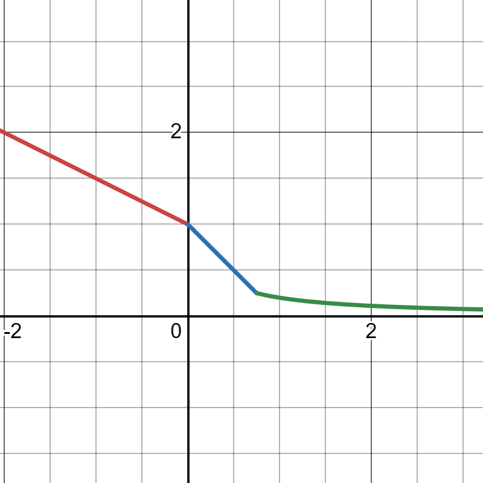

**Damage is one of the most important part of a game's combat system.** So I pick this part as the first chapter of all the mechanic articles. 
When characters, enemies or some gadgets attack their targets, they generally deal **damage** (abbreviated as **DMG**) based on their own and their targets' attributes. 
Note: A single instance of damage cannot exceed 9,999,999. HP loss is not damage. 
# General Damage Formula
For DMG dealt by Talents, Constellations, Weapon passives, enemy attacks or gadget attacks, the DMG is calculated as: 
$$DMG\enspace =\enspace ((Σ(Base\enspace DMG\enspace ×\enspace Base\enspace DMG\enspace Coefficient)\enspace +\enspace Additive\enspace Base\enspace DMG\enspace Bouns))\enspace ×\enspace DMG\enspace Bouns\enspace Multiplier\enspace ×\enspace DEF\enspace Multiplier_{Target}\enspace ×\enspace REs\enspace Multiplier_{Target}\enspace ×\enspace CRIT\enspace Multiplier\enspace ×\enspace Amplifying\enspace Multiplier\enspace ×\enspace Special\enspace Multiplier$$
## Base DMG
$$
\text { Base DMG }={\begin{array}{ll}
\text { Talent Scaling } × \text { ATK } & \text { if talent scales with ATK } \\
\text { Talent Scaling } × \text { DEF } & \text { if talent scales with DEF } \\
\text { Talent Scaling } × \text { Max HP } & \text { if talent scales with Max HP } \\
\text { Talent Scaling } × \text { EM } & \text { if talent scales with EM }
\end{array}}
$$

**Base DMG** is the amount of DMG resulted from multiplying the talent's scaling with the corresponding stat, before accounting for any damage modifiers. 
Unless otherwise specified in the talent's attributes, talents will scale with ATK. Some abilities may scale with more than one stat. 
For example, Nahida's [Elemental Skill](https://genshin-impact.fandom.com/wiki/All_Schemes_to_Know) has a Tri-Karma Purification DMG, this DMG scales with both ATK and EM. If your Nahida has 1400 ATK, 950 EM and Level 10 Elemental Skill, the base DMG of Tri-Karma Purification DMG is calculated as: 
$$Base\enspace DMG\enspace =\enspace 1.8576\enspace ×\enspace 1400\enspace +\enspace 3.7152\enspace ×\enspace 950\enspace =\enspace 6130.08 $$
**Base DMG Coefficient** is special coefficient that modifies Base DMG, it is directly multiplicative with Base DMG. It's generally discribed as "Attacks Deal *Coefficient* of the **original DMG**." In game, it can be found in Yoimiya's [Skill](https://genshin-impact.fandom.com/wiki/Niwabi_Fire-Dance), Neuvillette's [1st Ascension Passive](https://genshin-impact.fandom.com/wiki/Heir_to_the_Ancient_Sea%27s_Authority), Navia's [Skill](https://genshin-impact.fandom.com/wiki/Ceremonial_Crystalshot), Furina's [Skill](https://genshin-impact.fandom.com/wiki/Salon_Solitaire), Wanderer's [Skill](https://genshin-impact.fandom.com/wiki/Hanega:_Song_of_the_Wind), Wriothesley's [Skill](https://genshin-impact.fandom.com/wiki/Icefang_Rush), Xingqiu's [4th Constellation](https://genshin-impact.fandom.com/wiki/Evilsoother) and Traveler(Electro)'s [6th Constellation](https://genshin-impact.fandom.com/wiki/World-Shaker). 
### Additive Base DMG Bouns
**Additive Base DMG Bouns** is a bouns DMG added to the base DMG, it's generally fixed or scaling with attacker's stat or team member's stat. It's generally discribed as "Attack DMG is increased by *bouns%* of **stat**". This type of Additive Base DMG Bonus can be calculated in the same way as Base DMG. 
The other type of it is the damage bouns from **Spread and Aggravate** Elemental Reactions. When the attacks inflict Dendro or Electro on the target affected by Quicken Aura, the Spread or Aggravate will be triggered with a flat base DMG bouns. The bouns is calculated as:
$$Flat\enspace Base\enspace DMG\enspace Bouns\enspace =\enspace Reaction\enspace Coefficient\enspace ×\enspace Level\enspace Multiplier\enspace ×\enspace (1\enspace +\enspace EM Bouns\enspace +\enspace Reaction Bouns)$$
For Aggravate, the reaction coefficient is 1.15, for Spread 1.25. The level multiplier scales with attacker's level: [Level_Multiplier](https://github.com/mc-ctrl/Hoyoverse-Theorycrafting-Library/blob/main/Genshin_Impact/Level_Multiplier_Reaction.md) 
EM Bouns is the bouns from Element Mastery, for Aggravate and Spread, it's calculated as: 
$$EM\enspace Bouns\enspace =\enspace \frac{5\enspace ×\enspace EM}{EM\enspace +\enspace 1200}$$
Reaction Bouns is a special bouns type for element reaction, it's generally discribed as "The specified type of reaction DMG are increased by bouns%", this type of bouns is directly added to the EM Bouns. 
Assume there is a Level 90 Traveler(Electro) with 1600 ATK, 100 EM and Level 13 [Elemental Burst](https://genshin-impact.fandom.com/wiki/Bellowing_Thunder), his Falling Thunder DMG hits a enemy under Quicken Aura, this damage is increased by [6th Constellation](https://genshin-impact.fandom.com/wiki/World-Shaker). And he was just healed by Baizhu's  [Seamless Shields](https://genshin-impact.fandom.com/wiki/Holistic_Revivification), this Baizhu has 50000+ Max HP without additional constellation. Then this Falling Thunder DMG's total Base DMG Multiplier is calculated as: 
$$total\enspace Base\enspace DMG\enspace Multiplier\enspace =\enspace 0.6970\enspace ×\enspace 1600\enspace ×\enspace 2\enspace +\enspace 1.25\enspace ×\enspace (1\enspace +\enspace \frac{5\enspace ×\enspace 100}{100\enspace +\enspace 1200}\enspace +\enspace 0.4)\enspace ×\enspace 1446.853458\enspace =\enspace 5458.00 $$
## DMG Bouns Multiplier
DMG Bouns refers to all percentage-based DMG bounses, including Elemental, Physical DMG Bounses listed in the stats screen, as well as special percentage-based DMG bonus based on attacktag(Normal/Charged/Plunging Attack, Elemental Skill, Elemental Burst, etc.), all DMG bouns and so on. DMG Taken(Mona's [Elemental Burst](https://genshin-impact.fandom.com/wiki/Stellaris_Phantasm), Ganyu's [4th Constellation](https://genshin-impact.fandom.com/wiki/Westward_Sojourn)) and DMG Reduction(Xingqiu's [Rain Sword](https://genshin-impact.fandom.com/wiki/Westward_Sojourn),Beidou's [burst](https://genshin-impact.fandom.com/wiki/Stormbreaker), etc.) of target effectively add with DMG Bouns: 
$$DMG\enspace Bouns\enspace Multiplier\enspace =\enspace (1\enspace +\enspace ΣDMG\enspace Bouns_{Attacker}\enspace -\enspace DMG\enspace Reduction_{Target}\enspace +\enspace DMG\enspace Taken_{Target})$$
Note: Kairagi will gain a 80% Damage Reduction shortly after being aggravated, Frostarm Lawachurl will gain the same one during Shield. 
## CRIT Multiplier
When attack triggers a critical hit, damage will get a crit bouns. Crit Rate is a probability, so: 
$$ CRIT\enspace RATE_{Effective}\enspace =\enspace clamp\enspace[0\%,\enspace CRIT\enspace RATE,\enspace 100\%] $$ 
The crit multiplier is calculated as: 

$$
\text { CRIT Multiplier }={\begin{array}{ll}
\text { 1 + CRIT DMG } & \text { if CRIT } \\
\text { 1 } & \text { else } \\
\text { 1 + CRIT RATE Effective } × \text { CRIT DMG } & \text { Mean, for Expectation} 
\end{array}}
$$

The expectation of CRIT Multiplier is deduced as: 
$$E(CRIT)\enspace =\enspace 1\enspace ×\enspace (1\enspace -\enspace CRIT\enspace RATE_{Effective})\enspace +\enspace CRIT\enspace RATE_{Effective}\enspace ×\enspace (1\enspace +\enspace CRIT\enspace DMG)\enspace =\enspace 1\enspace +\enspace CRIT\enspace RATE_{Effective}\enspace ×\enspace CRIT\enspace DMG$$
## DEF Multiplier
DEF Multiplier is the multiplier that Defence(abbreviated DEF) reduces incoming damage, it's calculated as: 
$$DEF\enspace DMG\enspace Reduction\enspace =\enspace \frac{DEF_{Effective}}{DEF_{Effective}\enspace +\enspace Level\enspace Coeffcient_{Attacker}}$$
Then the DEF Multiplier is: 
$$DEF\enspace Multiplier\enspace =\enspace 1\enspace -\enspace DEF\enspace DMG\enspace Recduction$$
The Level CoeffcientAttacker can be calculated as: 
$$Level\enspace Coeffcient_{Attacker}\enspace =\enspace 5\enspace ×\enspace Level_{Attacker}\enspace +\enspace 500$$
The Enemy Defense is actually given by the product of Base Denfense and LLevel FactorDefense. For the Base Denfense is always 500, and the Level FactorDefense grows 0.01 each level from 1.01. The Enemy Defense is calculated as: 
$$DEF_{Enemy}\enspace =\enspace 5\enspace ×\enspace Level_{Enemy}\enspace +\enspace 500$$
As you see, this formula is the same as Level CoeffcientAttacker, so **the DEF Multiplier is generally 0.5 when the AttackerCharacter has the same level as TargetEnemy without any DEF Reduction or DEF Ignored.**
In game, there are DEF Reduction and DEF Ignored, the effective DEF is calculated as: 
$$DEF_{Effective}\enspace =\enspace DEF_{Original}\enspace ×\enspace (1\enspace -\enspace DEF\enspace Reduction_{Target})\enspace ×\enspace (1\enspace -\enspace DEF\enspace Ignored_{Attacker})$$
Note: DEFEffective ≥ 0 
If character attacks Enemy, the DEF Multiplier can be simplified as: 
$$DEF\enspace Multiplier\enspace =\enspace \frac{Level_{Character}\enspace +\enspace 100}{k(Level_{Enemy}\enspace +\enspace 100)\enspace +\enspace (Level_{Character}\enspace +\enspace 100)}$$
$$k\enspace =\enspace (1\enspace -\enspace DEF\enspace Reduction_{Enemy})\enspace ×\enspace (1\enspace -\enspace DEF\enspace Ignored_{Character})$$
## REs Multiplier
REs Multiplier is the multiplier that Resistances(abbreviated as REs) affect incoming damage. Targets have different Elemental REs and Physical RE. It's calculated as:

$$
\text { REs Multiplier }={\begin{array}{ll}
\text { 1 } - \text { REs/2 } & \text { if REs < 0 } \\
\text { 1 } - \text { REs } & \text { if REs ∈ [0, 0.75] } \\
\frac {1}{4\enspace ×\enspace REs\enspace +\enspace 1} & \text { if REs > 0.75 } 
\end{array}}
$$

</img> 
And the REsEffective is: 
$$REs_{Effective}\enspace =\enspace REs_{Original}\enspace -\enspace REs\enspace Reduction_{Target}\enspace -\enspace REs\enspace Penetrate_{Attacker}$$
[Enemy REs](https://genshin-impact.fandom.com/wiki/Resistance#Enemy_RES)

## Amplifying Multiplier
The amplifying reactions are Vaporize and Melt. Amplifying reactions add extra multipliers to the damage of the attack that triggered the reaction based on the triggering element and the elemental mastery of the triggering character. 

$$
\text { Amplifying Multiplier }={\begin{array}{ll}
\text { 1.5 } × \text { (1 + EM Bouns + Reaction Bouns) } & \text { if Pyro triggers Melt } \\
\text { 2 } × \text { (1 + EM Bouns + Reaction Bouns) } & \text { if Cryo triggers Melt } \\
\text { 1.5 } × \text { (1 + EM Bouns + Reaction Bouns) } & \text { if Hydro triggers Vaporize } \\
\text { 2 } × \text { (1 + EM Bouns + Reaction Bouns) } & \text { if Pyro triggers Vaporize } \\
\text { 1} & \text { otherwise} 
\end{array}}
$$

For Amplifying Reaction, the EM Bouns is calculated as:
$$EM\enspace Bouns\enspace =\enspace \frac{2.78\enspace ×\enspace EM}{EM\enspace +\enspace 1400}$$
## Special Multipliers
This part contains some multipliers unusual, they are default value most time, so most players may even not know them. 
### Damage Attenuation Multiplier
You may find enemy's DMG decreases as hits increase. That is Damage Attenuation! 
Most attack has AttenuationGroup and AttenuationTag. AttenuationGroup includes Reset Time, Damage Sequence, Poise Damage Sequence, Element Guage Sequence. In this chapter, we are concerned about the Reset Time and Damage Sequence. Other Sequences will be introduced in Interruption Resistance and Element Gauge Theory. The AttenuationGroup is usually called Internal Cooldown( abbreviated as ICD). 
For example, [Jadeplume Terrorshroom](https://genshin-impact.fandom.com/wiki/Jadeplume_Terrorshroom)'s Rapid Pecks when activated has a 6s Reset Time and [1,0.5,0.5,0.5] Damage Sequence. This attack has 4 hits. Thanks to Damage Sequence, if you are hit 4 times, the 2nd, 3rd and 4th hit only take 50% DMG of the first hit. When the first attack hits, the reset time starts. As soon as reset time ends, the Damage Sequence will be reset. If attacks from the same Attacker hit the same Target, and the AttenuationGroup and AttenuationTag are same, attacks will share Attenuation. 
For character's attack, observable Damage Attenuation is very rare, one is Yae Miko's Charged Attack has a 0.5s Reset Time and [1,0,0,0,0,0,0] Damage Sequence, which makes it can't make DMG to same Target within 0.5s. **Notable thing is the Transformative Reaction from same Attacker can only deal DMG to same Target within 0.5s for limited times( Electro-Charged and Overloaded for 1, others for 2), this is just Damage Attenuation.** So your Dendro Core can't hurt the Enemy too rapidly. 
Note: The Attenuation directly affects damage percentage, which means it directly multiplies with Base DMG.
### Damage Wane Multiplier
Do you konw the arrows from Bow Character will have a wane after a little while flying? Ganyu mains may know better about this. Actually, it's common to see that Ganyu attacks an enemy from a long distance(over 35m) with her [Frostflake Arrow](https://genshin-impact.fandom.com/wiki/Liutian_Archery). The Frostflake Arrow DMG may reduce a lot, this is Damage Wane. In the game, only Bow Character's Aimed Shoot will have a Wane. 
The Wane of Aimed Shoots is in the same regulations: 
If arrow flies within 0.7s, it doesn't wane. 
**After 0.7s, the DMG will wane 10% per 0.05s, up to 10% of the original damage.** There are a Hitlevel Wane and Element Guage Wane. They will be introduced in Interruption Resistance and Element Gauge Theory. 
Note: The Wane directly affects damage percentage, which means it directly multiplies with Base DMG. 
#### Supplementary Information for arrow's movement
*Aimed Shoots have the same movement:* 
*50m/s initial velocity, 25m linear range, 0.01s-1 air resistance coeffcient, 5.5m/s2 gravitional acceleration and 20s life time. That is to say, Aimed Shoot doesn't wane within about 35m. Nevertheless, arrow is a gadget, it's movement can be affected by the forces, such as WindZone Force, Airflow Force and so on. With enough information, We can easily discribe the movemont of the arrows.* 
*If you are intersted in it, you can try to calculate it:* 
*The air resistance coeffcient and gracitional acceleration don't work in the linear range, so the arrow generally makes a uniform linear motion of 0.5s. After the linear range, the works as following(Let air resistance coeffcient as A, gracitional acceleration as g, initial velocity as v0, Horizontal velocity as vx, Vertical velocity as vy, time as t):*
$$v_{x}\enspace =\enspace v_{x0}\enspace ×\enspace (1\enspace -\enspace At), \enspace v_{x}\enspace ≥\enspace 0$$
$$v_{y}\enspace =\enspace v_{y0}\enspace +\enspace gt$$
*Please note that v and g are vectors, they have directions.* 
*Actually, many gadgets' movements are in the similiar way, but this is another chapter.*  
**Multipliers above are only the common ones, multipliers were, are and will be updated.**
# Special Damage Formula
For DMG taking in different way, the formula is not entirely the same as general one. 
Multipliers are added, deleted and modified in these DMG. There are Transformative Reactionlike Damage and True Damage:
## Transformative Reactionlike Damage
You may confused with the title, this part is not Transformative Reaction Damage, at least, not entirely. I put a -like after Reaction is to say there are some DMG taking in the similar way with Transformative Reaction Damage. For example, the DMG from [Ocean-Hued Clam](https://genshin-impact.fandom.com/wiki/Ocean-Hued_Clam) works in same way. This kind of DMG has a special tag, IgnoreAttackerProperty. 
For this type of DMG, it has actually the same Damage Formula of general DMG, but some Multipliers are modified: 
$$DMG\enspace =\enspace ((Σ(Base\enspace DMG\enspace ×\enspace Base\enspace DMG\enspace Coefficient ×\enspace Transformative\enspace Reaction\enspace Multiplier)\enspace +\enspace Additive\enspace Base\enspace DMG\enspace Bouns))\enspace ×\enspace DMG\enspace Bouns\enspace Multiplier\enspace ×\enspace DEF\enspace Multiplier_{Target}\enspace ×\enspace REs\enspace Multiplier_{Target}\enspace ×\enspace CRIT\enspace Multiplier\enspace ×\enspace Amplifying\enspace Multiplier\enspace ×\enspace Special\enspace Multiplier$$
### Base DMG

## True Damage

# Try some exercises

# How to calculate accurately
